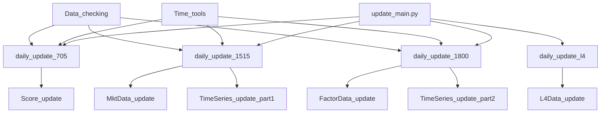
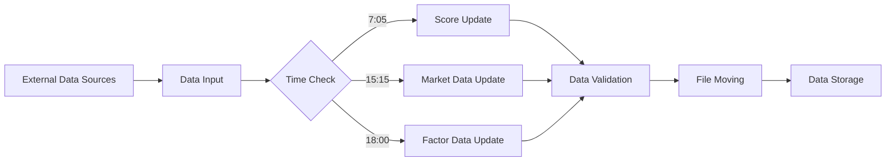

# Data Update System Analysis

## 1. 系统概述

这是一个金融数据更新系统，主要负责处理和更新各类金融数据，包括市场数据、因子数据、评分数据和L4数据等。系统采用定时任务的方式，在每天的不同时间点(7:05, 15:15, 18:00)执行不同的更新任务。

## 2. 目录结构

```
Data_update/
├── auto/
│   └── main.py                 # 自动化执行入口
├── config_path/                # 路径配置
├── config_project/             # 项目配置
├── Data_checking/             # 数据检查模块
├── FactorData_update/         # 因子数据更新
├── File_moving/              # 文件移动处理
├── global_tools_func/        # 全局工具函数
├── L4Data_update/            # L4数据更新
├── MktData_update/           # 市场数据更新
├── Score_update/             # 评分数据更新
├── Time_tools/               # 时间工具模块
├── TimeSeries_update/        # 时间序列更新
├── update_main.py            # 主更新程序
└── history_main.py           # 历史数据更新程序
```

## 3. 核心模块关系图



## 4. 数据流程图



## 5. 主要功能模块分析

### 5.1 时间控制模块 (Time_tools)
- 负责确定目标日期和时间窗口
- 提供工作日判断功能
- 管理不同更新任务的执行时间

### 5.2 数据更新模块
- **市场数据更新 (MktData_update)**
  - 指数收益更新
  - 指数成分更新
  - 股票数据更新

- **因子数据更新 (FactorData_update)**
  - 因子暴露度更新
  - 因子收益更新
  - 股票池更新
  - 因子协方差更新

- **评分数据更新 (Score_update)**
  - RR评分更新
  - 组合评分更新
  - 综合评分更新

- **L4数据更新 (L4Data_update)**
  - L4持仓更新
  - L4信息更新
  - L4产品更新

### 5.3 数据检查模块 (Data_checking)
- 数据完整性检查
- 数据质量验证
- 异常检测

## 6. 配置管理

系统使用多层配置管理：
- `config_project/`: 项目级配置
- `config_path/`: 路径配置
- 各模块特定配置文件 (如 `time_tools_config.xlsx`, `L4_config.xlsx`)

## 7. 自动化执行

```python
# auto/main.py 示例
def time_705():
    daily_update_705()

def time_1515():
    daily_update_1515()

def time_1800():
    daily_update_1800()
```

系统通过Windows任务计划程序执行批处理文件，进而调用Python脚本完成自动化更新。

## 8. 数据存储结构

数据主要以CSV文件形式存储，包括：
- 市场数据文件
- 因子数据文件
- 评分数据文件
- 时间序列数据文件
- L4数据文件

## 9. 错误处理和日志

系统应该包含（但在代码中未完全显示）：
- 异常捕获和处理机制
- 日志记录系统
- 错误通知机制

## 10. 开发环境

- Python环境: Anaconda
- IDE: PyCharm
- 版本控制: Git
- 主要依赖包: pandas, numpy等

## 11. 建议改进

1. 增加详细的日志记录
2. 添加单元测试
3. 改进错误处理机制
4. 添加监控告警系统
5. 优化配置管理方式
6. 增加数据备份机制

这个系统整体设计较为完整，模块划分清晰，但在实际运行中可能需要根据具体需求进行进一步的优化和完善。