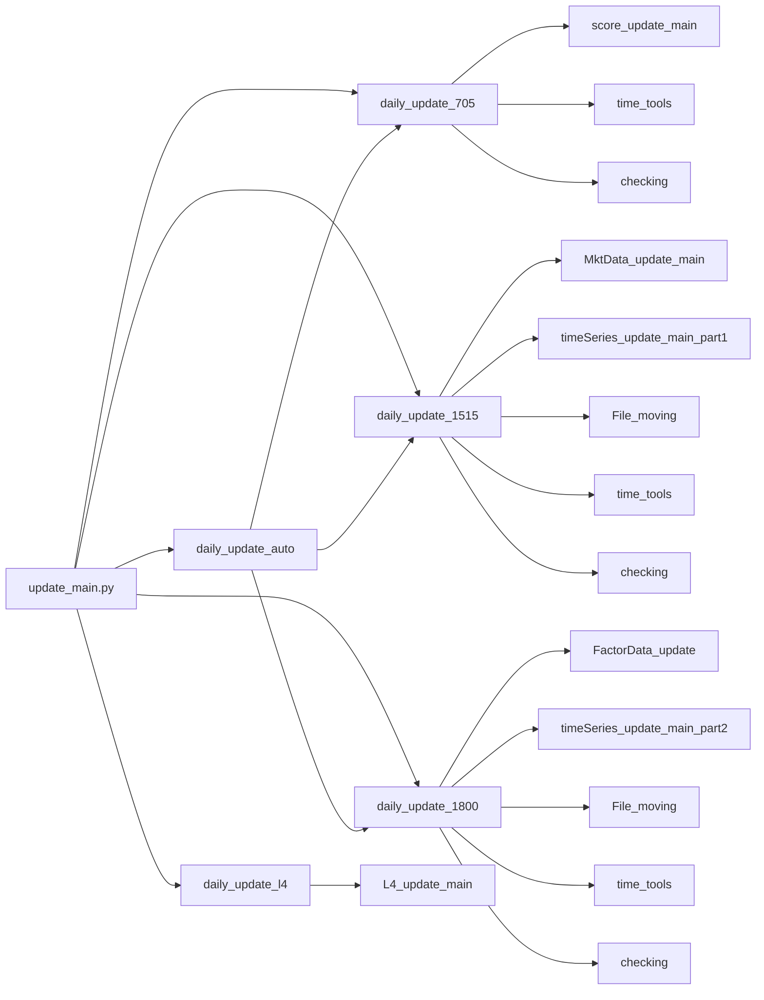
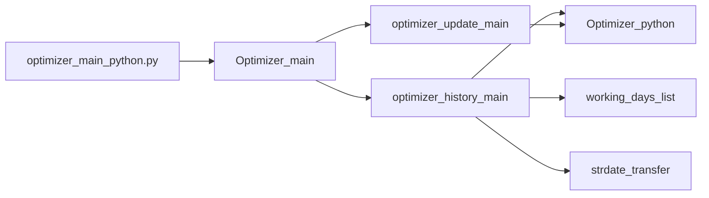

# Code Analysis

## Data_update

The `code/Data_update/update_main.py` file is the main entry point for the data update process. It contains functions for updating score data, market data, factor data, time series data, and L4 data. The updates are performed at specific times of the day (7:05, 15:15, and 18:00), and there is also a function for performing L4 data updates.

### Functions

*   **`daily_update_705`:** Updates score data.
*   **`daily_update_1515`:** Updates market data and time series data.
*   **`daily_update_1800`:** Updates factor data and time series data.
*   **`daily_update_auto`:** Orchestrates the daily updates based on the current time.
*   **`daily_update_l4`:** Updates L4 data.

The `daily_update_auto` function determines the current time zoom and calls the corresponding update function. The other update functions call functions in other modules to perform the actual updates and data checks.

### Function Chart

The following function chart illustrates the relationships between the main functions in the `code/Data_update/update_main.py` file:



## Optimizer

The `code/Optimizer/Optimizer_python/main/optimizer_main_python.py` file contains the main optimization logic. It defines the `Optimizer_main` class, which has methods for performing historical optimization and updating optimization results.

### Functions

*   **`optimizer_history_main`:** Performs historical optimization for a given date range and list of score names.
*   **`optimizer_update_main`:** Performs optimization for a given target date and list of score names.

### Function Chart

The following function chart illustrates the relationships between the main functions in the `code/Optimizer/Optimizer_python/main/optimizer_main_python.py` file:



## Tracking

The `code/Tracking/Signal_tracking/update_main.py` file contains the main logic for updating signal tracking data. It includes functions for performing cross-sectional updates, time series updates, and historical updates.

### Functions

*   **`timeSeries_main`:** Performs time series tracking for a given list of portfolio names.
*   **`tracking_score_withdraw`:** Reads data from an Excel file and extracts lists of score names, base scores, and index types.
*   **`cross_section_update_main`:** Performs cross-sectional updates for a given target date.
*   **`update_main`:** Triggers the signal tracking update process.
*   **`history_main`:** Performs historical signal tracking for a given date range.

### Function Chart

The following function chart illustrates the relationships between the main functions in the `code/Tracking/Signal_tracking/update_main.py` file:

```mermaid
graph LR
    A[update_main.py] --> B[timeSeries_main]
    A --> C[tracking_score_withdraw]
    A --> D[cross_section_update_main]
    A --> E[update_main]
    A --> F[history_main]

    D --> C
    D --> G[analyse_main]

    E --> D
    E --> B

    F --> D
    F --> B
    F --> H[working_days_list]

    B --> I[ScoreTracking_timeSeries_main_weight]
    B --> J[ScoreTracking_timeSeries_main_port]